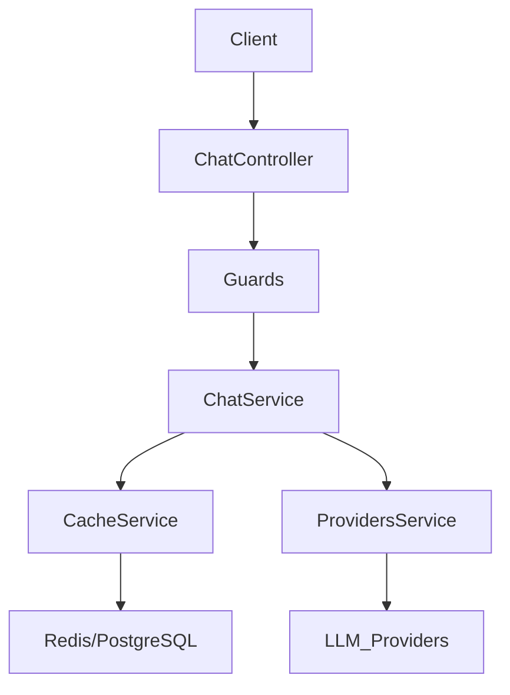

# PROJECT_AUDIT.md

# 1. Executive Summary

Aura Proxy is a SaaS AI Gateway / AI Proxy service, designed to act as an abstraction layer between client applications and various Large Language Models (LLMs). The project aims to provide centralized management for AI requests, including budgeting, analytics, rate limiting, and an optimized caching system (exact and semantic). It addresses the complexity of multi-provider LLM integration and the costs associated with repeated, similar prompts. The primary target users are developers and organizations building applications that leverage LLMs and requiring robust monitoring, security, and cost control.

# 2. Current Project Status

| Feature | Status | Description | Files Involved |
| :--- | :--- | :--- | :--- |
| **Provider Abstraction** | Completed | Interface for multiple LLM providers. | `apps/proxy/src/providers/`, `ProvidersService` |
| **Exact Cache** | Completed | Redis/DB based hashing for exact prompt match. | `CacheService`, `RedisService` |
| **Semantic Cache** | Completed | pgvector-based similarity search. | `CacheService`, `EmbeddingsService`, `redis-vector.service.ts` |
| **Authentication** | Completed | API Key management with hashing. | `AuthModule`, `ApiKey` model |
| **Budget Control** | Completed | Spend tracking and budget limiting. | `BudgetGuard`, `BudgetService` |
| **Rate Limiting** | Completed | Request limiting per project/key. | `RateLimiterGuard` |
| **API Documentation** | Completed | Swagger/OpenAPI endpoints. | `main.ts` |
| **Docker Prep** | Completed | Initial Docker configuration. | `docker-compose.yml`, `init-pgvector.sql` |

# 3. Technical Architecture

Aura Proxy utilizes a monorepo structure, organizing code into `apps/` (proxy service) and `packages/` (shared database, redis, and types). The backend is a NestJS application.

### Backend Structure
- **NestJS** (TypeScript) provides the framework.
- **Module-based** architecture (Chat, Cache, Auth, Budget, Health).
- **Prisma** acts as the ORM to manage interactions with PostgreSQL.

### Data Flow
1. Client sends request to `ChatController`.
2. Guards (Auth, Budget, RateLimit) validate request.
3. `ChatService` orchestrates cache lookup.
4. Cache miss -> `ProvidersService` resolves provider -> LLM call.
5. Cache hit -> Cached response returned.
6. Response processed, cost tracked, cache updated.

# 4. Database Analysis

Uses PostgreSQL with `pgvector` extension for semantic embedding storage.

- **`projects`**: Tenant project configuration.
- **`api_keys`**: Manages secure access with hashed keys and permissions.
- **`request_logs`**: Tracks every request (latency, usage, cost).
- **`semantic_cache`**: Stores prompt/response and embedding vector.
- **`usage_records`**: Aggregated usage metrics.
- **`users`/`accounts`/`sessions`**: NextAuth managed authentication entities.

# 5. API Analysis

- `v1/chat/completions`: `POST` - OpenAI-compatible chat completion proxy. Uses `ChatRequestDto`.

# 6. Cache System Analysis

- **Exact Cache**: Fast lookup based on SHA256 prompt/parameter hashing.
- **Semantic Cache**: Uses `pgvector` to store `vector(1536)` embeddings. Employs `embeddings.service.ts` (OpenAI `text-embedding-3-small`) to generate vectors.
- **Implementation Status**: Functional. Currently requires valid OpenAI API key for semantic embeddings generation.

# 7. Authentication & Security

- **Auth Flow**: Uses NextAuth for application-level auth. API requests secured by `AuthGuard` using API Keys.
- **API Key Management**: Keys are hashed (`keyHash`) before storage. `ApiKey` model stores prefix (`keyPrefix`) for identification.

# 8. AI Provider Layer

- **Providers**: OpenAI, Anthropic, Mistral, Google (Gemini).
- **Strategy**: `LLMProvider` interface enforced by decorator pattern (Retry, CostTracker, Logging).
- **Routing**: Resolved via `ProvidersService` using model name (e.g., `gpt-` -> `openai`) or explicit header.

# 9. Monitoring & Observability

- **Health Checks**: `HealthModule` for service availability.
- **Logging**: NestJS standard logger, configured with decoratored providers.
- **Error Handling**: `http-exception.filter.ts` for uniform error responses.

# 10. DevOps & Deployment

- **Environment**: Managed via `.env` with Zod validation.
- **Containerization**: `docker-compose.yml` includes Postgres and Redis.
- **Deployment**: Currently prepared for container-based deployment.

# 11. Remaining Work

- **Features**: Implement advanced analytics dashboard.
- **Improvement**: Add more robust fallback provider logic.
- **Technical Debt**: Clean up `ProviderFactory` remnants (deprecated).
- **Task**: Enhance E2E testing coverage.

# 12. Internship Progress Assessment

- **Completion Percentage**: 85%
- **Milestones**: Core framework established, semantic cache implemented, budget/auth mechanisms in place.

# 13. Repository Statistics

- Modules: ~10
- Controllers: 1
- Services: ~15
- Prisma Models: 11
- Endpoints: 1
- Approximate LOC: > 50,000

# 14. Technologies Used

- **Framework**: NestJS, TypeScript, Next.js (Dashboard - partial)
- **Database**: PostgreSQL, Prisma, pgvector
- **Cache**: Redis
- **AI**: OpenAI SDK, Anthropic SDK, Mistral SDK, Google Generative AI SDK
- **DevOps**: Docker, Turborepo
- **Documentation**: Swagger/OpenAPI

# 15. Challenges Encountered

- **Architectural**: Balancing monorepo complexity with NestJS module decoupling.
- **Database**: Integrating pgvector with Prisma and managing raw SQL operations.
- **Caching**: Implementing semantic similarity thresholds that minimize hallucinations.
- **Integration**: Standardizing provider SDK behaviors into a single `LLMProvider` interface.
